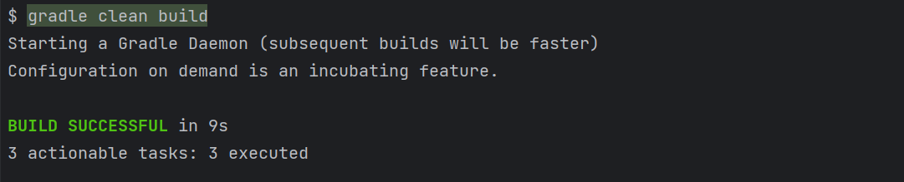

# NIXLPER

This is my personnal helper in Unix environment. I took the philosophy from [Total commander](https://www.ghisler.com/accueil.htm) and tried to apply it in Unix.

## Table of Contents

- [Project Title](#nixlper)
- [Description](#description)
- [Prerequisites](#prerequisites)
  - [Java (mandatory)](#java-mandatory)
  - [Gradle (optional)](#gradle-optional)
- [Build](#build)
  - [Build with Gradle wrapper](#build-with-gradle-wrapper)
  - [Build with local Gradle installation](#build-with-local-gradle-installation)
- [Installation](#installation)
  - [Standard installation steps](#standard-installation-steps)
  - [Installation steps without Gradle build](#installation-steps-without-gradle-build)
- [Features](#features)
  - [Bookmarks](#bookmarks)
  - [Files and folders](#files-and-folders)
- [License](#license)

## Description

The goal of the bash project is to provide useful Unix commands for various purpose. It takes the philosophy from [Total commander](https://www.ghisler.com/accueil.htm) 
and this is why it contains a lots of key shortcuts

## Prerequisites

### Java (mandatory)

This project is built with [Gradle](#gradle) using [JDK 20](https://www.oracle.com/java/technologies/javase/jdk20-archive-downloads.html).

### Gradle (optional)

This project is built using [Gradle](https://gradle.org/releases/) 8.4, but you can go for the latest version. If you want to avoid Gradle
installation you build the project using the [Gradle wrapper](#build-with-gradle-wrapper).

## Build
You can either build with Gradle wrapper or with your local Gradle installation.

### Build with Gradle wrapper
Perform the following command in the project:
```bash
./gradlew clean build
```
Build result should be like the screenshot below:



Resulting archives lays in build/distributions folder after Gradle command.
- build/distributions/nixlper-<version>.tar
- build/distributions/nixlper-<version>.zip

## Build with local Gradle installation

If you have Gradle installed on your computer, you can perform the following command in the project:
```bash
gradle clean build
```
Build result should be like the screenshot below:


Resulting archives lays in build/distributions folder after Gradle command.
- build/distributions/nixlper-<version>.tar
- build/distributions/nixlper-<version>.zip

## Installation

### Standard installation steps

- Put the archive (zip or tar) on any server in the folder you want to install it (for instance **/opt/nixlper**).
- Unpack it using the "unzip" command or "tar -xf" command.
- Then run ./nixlper-<version>.sh install

```bash
mkdir -p /opt/nixlper
# copy archive, /tmp is example
cp /tmp/nixlper*zip /opt/nixlper
cd /opt/nixlper
unzip nixlper*.zip
./nixlper.sh install
```

Your .bashrc file will be updated and nixlper will be ready to be used for next login.

Now you are done, but if you don't use Gradle you can follow steps from [next chapter](#installation-steps-without-gradle-build).
Otherwise, please see existing [features](#features).

### Installation steps without Gradle build

Gradle is not performing a lot of tasks apart from creating an archive including the version although it is recommended 
to use. If you are too lazy to use Gradle you can simply perform the actions listed below:

Copy the file [src/main/bash/nixlper.sh](src/main/bash/nixlper.sh) in a dedicated location then source it. 
Below is an example of installation steps:

```bash
mkdir -p /opt/nixlper
cp nixlper.sh /opt/nixlper
cd /opt/nixlper
./nixlper.sh install
```
## Features

### Bookmarks
- `CTRL + X then D`: display existing bookmarks
- `CTRL + X then B`: add or remote existing bookmark for **current** folder

### Files and folders

- `cdf FILEPATH`: Go the folder of the file

- `c`: mark current folder, use `gc` to go this folder from any place
`cf FILEPATH` : mark file as current, use `gcf` to open it in vim from any place.

## License

This project is licensed under the MIT License - see the [LICENSE](LICENSE) file for details.
